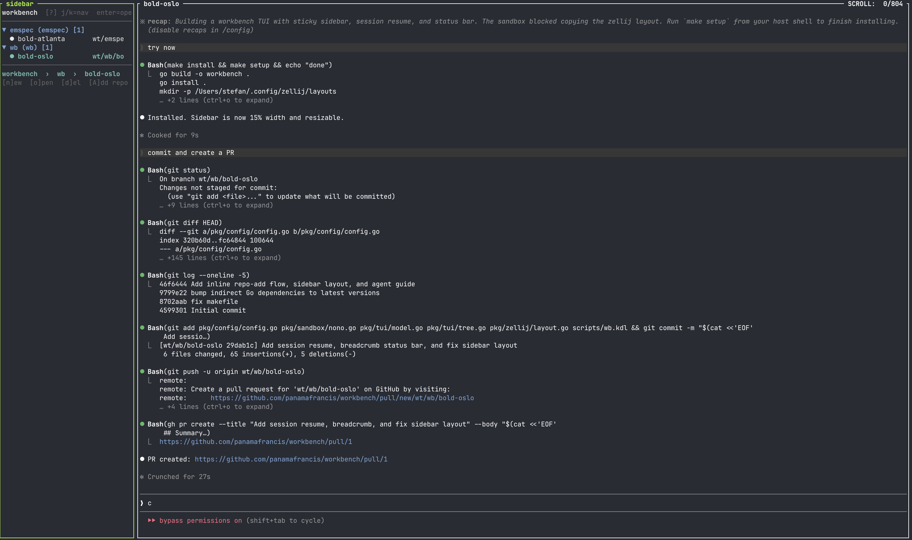

# workbench

A sandboxed git worktree manager. Each piece of work gets its own git worktree running inside a [nono](https://github.com/panamafrancis/nono) security sandbox. A persistent Zellij sidebar shows your worktrees; selecting one opens a new Zellij tab with your chosen LLM sandboxed via nono.



## Requirements

- Go 1.22+
- [nono](https://github.com/panamafrancis/nono) at `/opt/homebrew/bin/nono`
- [Zellij](https://zellij.dev) 0.43+
- git

## Install

```sh
go install github.com/panamafrancis/workbench@latest
```

Or build from source:

```sh
git clone https://github.com/panamafrancis/workbench
cd workbench
go build -o /usr/local/bin/workbench .
```

## Setup

### 1. Create a Zellij layout

Copy `scripts/wb.kdl` to your Zellij layouts directory:

```sh
cp scripts/wb.kdl ~/.config/zellij/layouts/wb.kdl
```

This layout opens a resizable sidebar running `workbench ls` alongside a shell pane.

### 2. Start a session

```sh
zellij --layout ~/.config/zellij/layouts/wb.kdl
```

### 3. Register a repo

```sh
workbench add repo /path/to/your/repo --alias=myrepo
```

## Usage

```
workbench add repo <path> --alias=<alias>     register a repo
workbench rm  repo <alias>                    unregister a repo

workbench add worktree --repo=<alias>         create a worktree (auto-named)
workbench add worktree --repo=<alias> --name=<name> [--branch=<branch>]
workbench rm  worktree <name>                 remove a worktree

workbench ls [--repo=<alias>]                 open TUI (or plain text when piped)
workbench open --worktree=<name> [--model=<model>] [--repo=<alias>] [--no-zellij]
```

### Worktree names

Auto-generated names are `<adjective>-<city>` (e.g. `bold-atlanta`). Names are globally unique across all repos — they serve as Zellij tab titles. Custom names must be lowercase alphanumeric and hyphens, 1–24 characters.

### TUI key bindings

| Key | Action |
|-----|--------|
| `j` / `↓` | Move down |
| `k` / `↑` | Move up |
| `Enter` / `o` | Open selected worktree |
| `O` | Open with model picker |
| `Space` / `Tab` | Collapse/expand repo |
| `n` | New worktree |
| `d` | Delete worktree |
| `A` | Add repo |
| `r` | Refresh dirty status |
| `?` | Toggle help |
| `q` / `Esc` | Quit |

Mouse: click a repo header to collapse/expand; click a row to select.

The sidebar refreshes automatically when its pane gains focus (e.g. switching back from a worktree tab), so the `▶` running indicators stay up to date without pressing `r`.

## Configuration

All state lives under `~/.workbench/`:

| Path | Purpose |
|------|---------|
| `~/.workbench/config.yml` | Main config |
| `~/.workbench/worktrees/<alias>/<name>/` | Default worktree location |
| `~/.workbench/layouts/<name>.kdl` | Generated Zellij layouts (transient) |

### Example config

```yaml
version: 1
default_model: claude
worktree_base: ""          # empty = ~/.workbench/worktrees/
default_zellij_layout: ""
sidebar_width: "15%"       # sidebar pane width in new worktree tabs

models:
  claude:
    nono_profile: claude-code
    binary: claude
    args: []
    resume_args: ["--continue"]  # appended when reopening an existing session
  codex:
    nono_profile: default
    binary: codex
    args: []
  shell:
    nono_profile: default
    binary: bash
    args: []

repos:
  - alias: ss
    local_path: /path/to/scoring-service
    startup_script: ""     # run before opening a worktree
    cleanup_script: ""     # run before removing a worktree
    worktrees:
      - name: atlanta
        branch: wt/ss/atlanta
        path: /Users/you/.workbench/worktrees/ss/atlanta
        model: claude
```

### Custom models

`models` is an open map — add any binary with any nono profile:

```yaml
models:
  mymodel:
    nono_profile: default
    binary: /path/to/my-llm
    args: ["--some-flag"]
```

Then use it with `workbench open --model=mymodel` or set it as `default_model`.

### Startup and cleanup scripts

Scripts are run as `bash -- <script>` with two environment variables:

| Variable | Value |
|----------|-------|
| `WORKBENCH_WORKTREE_PATH` | Absolute path to the worktree |
| `WORKBENCH_WORKTREE_NAME` | Worktree name |

```yaml
repos:
  - alias: ss
    startup_script: /path/to/setup.sh    # runs on workbench open
    cleanup_script: /path/to/teardown.sh # runs on workbench rm worktree
```

### Sidebar width

Set `sidebar_width` to control the sidebar pane width in new worktree tabs (default `"15%"`). Already-open tabs are not affected — this is a Zellij limitation.

```yaml
sidebar_width: "20%"
```

## How `open` works

```
workbench open --repo=ss --worktree=atlanta --model=claude
  1. Resolve model → look up nono profile and binary from config
  2. If a tab with the same name exists but its command has exited, close it
  3. Run startup_script (if configured)
  4. Write ~/.workbench/layouts/atlanta.kdl
  5. zellij action new-tab --name atlanta --layout ~/.workbench/layouts/atlanta.kdl
```

Outside Zellij, use `--no-zellij` to print the raw command instead:

```sh
workbench open --worktree=atlanta --no-zellij
# cd /path/to/worktree && nono "run" "--profile" "claude-code" ...
```

## Session lifecycle

When a worktree's command exits (e.g. typing `exit` in a claude session), the pane auto-closes (`close_on_exit`). If you later press `o` on that worktree in the sidebar, workbench detects the stale tab (sidebar-only, no running command) and recreates it with a fresh session. If the session is still running, `o` focuses the existing tab.

## nono profile

workbench passes `--allow <worktree-path>` to nono so the sandboxed process can read and write only its own worktree. The profile name comes from the model config entry (`nono_profile`). The built-in `claude` model uses the `claude-code` profile; everything else defaults to `default`.
