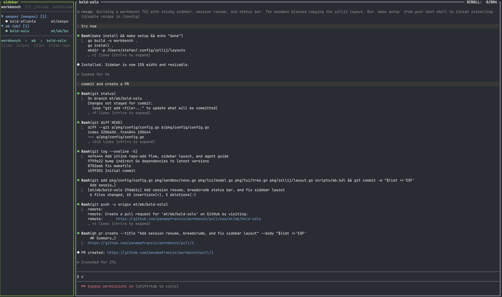

# workbench

A sandboxed git worktree manager. Each piece of work gets its own git worktree running inside a [nono](https://nono.sh) security sandbox. A persistent Zellij sidebar shows your worktrees; selecting one opens a new Zellij tab with your chosen LLM sandboxed via nono.



## Requirements

- Go 1.22+
- [nono](https://nono.sh) — capability-based sandbox (macOS via Seatbelt, Linux via Landlock)
- [Zellij](https://zellij.dev) 0.43+
- git

## Install

```sh
go install github.com/panamafrancis/workbench@latest
```

Or build from source:

```sh
git clone https://github.com/panamafrancis/workbench
cd workbench
go build -o /usr/local/bin/workbench .
```

## Setup

```sh
workbench init       # interactive wizard: config, nono profile, gh auth, first repo
workbench doctor     # verify all dependencies are installed and configured
workbench start      # launch a Zellij session with the sidebar
```

`workbench init` creates `~/.workbench/config.yml`, optionally generates a nono profile (globbing your `~/.ssh/*.pub` keys), and offers to run `gh auth login`.

`workbench doctor` checks: zellij, nono, git, gh auth, config, nono profiles, SSH agent, and registered repos.

### Register a repo

```sh
workbench add repo /path/to/your/repo --alias=myrepo
```

## Usage

```
workbench start [session-name]                start or attach to a Zellij session
workbench start --ls                          list workbench sessions
workbench start --gc                          delete dead sessions

workbench add repo <path> --alias=<alias>     register a repo
workbench rm  repo <alias>                    unregister a repo

workbench add worktree --repo=<alias>         create a worktree (auto-named)
workbench add worktree --repo=<alias> --name=<name> [--branch=<branch>]
workbench rm  worktree <name>                 remove a worktree

workbench ls [--repo=<alias>]                 open TUI (or plain text when piped)
workbench open --worktree=<name> [--model=<model>] [--repo=<alias>] [--no-zellij]
workbench open --worktree=<name> --session=<session>   target a specific session

workbench rename-branch <new-branch> [--worktree=<name>] [--push]
workbench stats                                show lifetime statistics and achievements
workbench init [--non-interactive] [--profile]
workbench doctor [--json]
workbench uninstall [--dry-run] [--keep-config] [--force]
workbench docs [topic]                        show documentation (topics: overview, commands, config, ...)
workbench mcp                                 MCP server (stdio, used by Claude Code)
workbench version
```

### Session management

Running bare `workbench` with no arguments auto-starts (or resumes) the default session — equivalent to `workbench start`. Inside Zellij it shows help; with no config it hints at `workbench init`.

`workbench start` replaces the old `zellij --layout ...` workflow. It embeds the session layout, manages `wb-`-prefixed Zellij sessions, and uses `syscall.Exec` so workbench doesn't linger as a wrapper process.

Multiple sessions are supported — `workbench start work` and `workbench start client-x` run independently. Two terminals can attach to the same session (Zellij multi-client).

### Worktree names

Auto-generated names are city names (e.g. `tokyo`, `nairobi`). On collision, a numeric suffix is added (`tokyo-2`, `tokyo-3`). ~200 cities are available. Names are globally unique across all repos — they serve as Zellij tab titles. Custom names must be lowercase alphanumeric and hyphens, 1–24 characters.

A retired name isn't handed back out immediately. When a worktree is removed, its name is held in a reserved-cities cache (`reserved_cities` in `state.yml`) and stays excluded from generation until both the worktree is gone **and** its Claude session history has been cleaned up. This prevents a fresh worktree from colliding with a stale Zellij tab or resuming an unrelated Claude session of the same name. Deleting through workbench clears the history, so those names free up on the next generation; a name whose transcript lingers stays reserved until it's gone. (Explicitly passing `--name`/typing a name bypasses the reservation.)

### Branch renaming

Auto-created branches carry the worktree name (`wt/<alias>/<name>`). Before creating a PR, rename to something meaningful:

```sh
workbench rename-branch wt/wb/session-launcher        # renames + updates config + PR cache
workbench rename-branch wt/wb/session-launcher --push  # also pushes and deletes old remote branch
```

Do not use bare `git branch -m` — it desyncs workbench config and the PR cache.

### TUI key bindings

| Key | Action |
|-----|--------|
| `j` / `↓` | Move down (skips repo headers) |
| `k` / `↑` | Move up (skips repo headers) |
| `Enter` / `o` | Open selected worktree |
| `O` | Open with model picker |
| `Space` / `Tab` | Collapse/expand repo |
| `h` / `←` | Collapse containing repo |
| `l` / `→` | Expand containing repo |
| `n` | New worktree |
| `d` | Delete worktree |
| `A` | Add repo |
| `r` | Refresh dirty status |
| `?` | Toggle help (includes zellij primer) |
| `q` / `Esc` | Quit (confirms in sidebar mode) |

The sidebar shows a gamification stats box (cities visited, lifetime counters, streak, latest achievement) and a stats line at the bottom (repo count, worktree count, running/dirty/PR indicators) with context-sensitive key hints. Hide the stats box with `show_stats: false` in config.

Each worktree tab has its own sidebar, and the worktree that tab belongs to is marked with a `▸` in the gutter ("you are here"). This marker is independent of the cursor selection (the highlighted row), so it keeps pointing at the current worktree even as you navigate the list. The root session sidebar (from `workbench start`) isn't tied to a worktree, so it shows no marker.

Mouse: click a repo header to collapse/expand; click a worktree row to select.

The sidebar auto-restarts if it crashes or is accidentally quit — the layout wraps `workbench ls` in a restart loop. It waits 2 seconds between restarts (5 seconds if `workbench ls` exits with an error). Restarts reuse the on-disk PR status cache rather than re-querying GitHub, so a churning sidebar doesn't hammer the API.

The sidebar re-reads the shared on-disk state (`config.yml` + `state.yml`) when its pane gains focus (e.g. switching back from a worktree tab) and periodically on its tick, so the worktree list, gamification stats, and `▶` running indicators stay consistent across tabs without pressing `r`. This local re-sync skips the network PR lookup that a full refresh (`r`) performs, so it's cheap enough to run on every focus change — long-lived sidebars no longer show a stale snapshot that another tab has since changed.

PR status is fetched via the `gh` CLI (GitHub's GraphQL API) and cached on disk. If GitHub rate-limits the account, the sidebar shows a `gh rate limited` hint and pauses all PR fetches for 15 minutes before retrying, so it recovers on its own without draining the quota.

### Offline support

Worktree creation works offline — if `git fetch` fails, workbench falls back to the last-fetched `origin/<default>` ref and prints a warning. The default branch is auto-detected via `git symbolic-ref refs/remotes/origin/HEAD` (falls back to `main`, then `master`).

## Configuration

All state lives under `~/.workbench/`:

| Path | Purpose |
|------|---------|
| `~/.workbench/config.yml` | Main config |
| `~/.workbench/state.yml` | Last-run version, update check cache, gamification stats |
| `~/.workbench/worktrees/<alias>/<name>/` | Default worktree location |
| `~/.workbench/layouts/<name>.kdl` | Generated Zellij layouts (transient) |
| `~/.workbench/cache/` | PR status cache |
| `~/.workbench/logs/` | Zellij error log |

### Example config

```yaml
version: 1
default_model: claude
worktree_base: ""          # empty = ~/.workbench/worktrees/
default_zellij_layout: ""  # override the embedded session layout
sidebar_width: "20%"       # sidebar pane width in new worktree tabs
update_check_disabled: false  # set true to disable the update check on start
show_stats: true           # show gamification stats box in the sidebar (default true)

models:
  claude:
    nono_profile: claude-code
    binary: claude
    args: []
    resume_args: ["--continue"]  # appended when reopening an existing session
  codex:
    nono_profile: default
    binary: codex
    args: []
  shell:
    nono_profile: default
    binary: bash
    args: []

repos:
  - alias: ss
    local_path: /path/to/scoring-service
    copy_files: [".claude", ".env"]  # copied from repo to new worktrees
    startup_script: ""     # run before opening a worktree
    cleanup_script: ""     # run before removing a worktree
    worktrees:
      - name: atlanta
        branch: wt/ss/atlanta
        path: /Users/you/.workbench/worktrees/ss/atlanta
        model: claude
```

### Custom models

`models` is an open map — add any binary with any nono profile:

```yaml
models:
  mymodel:
    nono_profile: default
    binary: /path/to/my-llm
    args: ["--some-flag"]
```

Then use it with `workbench open --model=mymodel` or set it as `default_model`.

### Startup and cleanup scripts

Scripts are run as `bash -- <script>` with these environment variables:

| Variable | Value |
|----------|-------|
| `WORKBENCH_REPO_BASE_PATH` | Absolute path to the repo (the `local_path` from config) |
| `WORKBENCH_WORKTREE_PATH` | Absolute path to the worktree |
| `WORKBENCH_WORKTREE_NAME` | Worktree name |

```yaml
repos:
  - alias: ss
    startup_script: /path/to/setup.sh    # runs on workbench open
    cleanup_script: /path/to/teardown.sh # runs on workbench rm worktree
```

### Copying files to new worktrees

Git worktrees only contain tracked files. To automatically copy gitignored files (like `.env` or `.claude/`) from the repo into each new worktree, use `copy_files`:

```yaml
repos:
  - alias: ss
    copy_files:
      - .claude
      - .env
```

Paths are relative to the repo root. Both files and directories are supported. Directories are copied recursively. The copy runs after `git worktree add` and before any startup script.

### Sidebar width

Set `sidebar_width` to control the sidebar pane width in new worktree tabs (default `"20%"`). Already-open tabs are not affected — this is a Zellij limitation.

```yaml
sidebar_width: "20%"
```

## How `open` works

```
workbench open --repo=ss --worktree=atlanta --model=claude
  1. Resolve model → look up nono profile and binary from config
  2. If a tab with the same name exists but its command has exited, close it
  3. Run startup_script (if configured)
  4. Write ~/.workbench/layouts/atlanta.kdl (with WORKBENCH_* env vars)
  5. zellij action new-tab --name atlanta --layout ~/.workbench/layouts/atlanta.kdl
```

The agent pane receives these environment variables:

| Variable | Value |
|----------|-------|
| `WORKBENCH` | `1` |
| `WORKBENCH_WORKTREE_NAME` | Worktree name |
| `WORKBENCH_REPO_ALIAS` | Repo alias |
| `WORKBENCH_BRANCH` | Branch name |

Outside Zellij, use `--no-zellij` to print the raw command instead:

```sh
workbench open --worktree=atlanta --no-zellij
# cd /path/to/worktree && nono "run" "--profile" "claude-code" ...
```

Or target a specific session from outside Zellij:

```sh
workbench open --worktree=atlanta --session=wb-main
```

## Session lifecycle

When a worktree's command exits (e.g. typing `exit` in a claude session), the pane auto-closes (`close_on_exit`). If you later press `o` on that worktree in the sidebar, workbench detects the stale tab (sidebar-only, no running command) and recreates it with a fresh session. If the session is still running, `o` focuses the existing tab.

### Deleting worktrees

Deleting a worktree (`d` in the sidebar or `workbench rm worktree <name>`) runs the repo's cleanup script, removes the git worktree directory (`git worktree remove --force`), deletes the auto-created `wt/<alias>/<name>` branch, removes the config entry, and cleans up the generated Zellij layout. The sidebar and the CLI perform the same steps.

It also clears the agent's cached session transcripts for that path (e.g. `~/.claude/projects/<encoded-path>/`). This prevents a future worktree created at the same path from being silently resumed via `resume_args` (`--continue`) into an unrelated session. Config writes for create and delete are done as read-modify-write against the on-disk config, so an action in one process or sidebar instance never resurrects a worktree another deleted.

## Update checking

`workbench start` checks for newer releases via the GitHub API (cached for 24 hours, silent on network failure). Disable with `update_check_disabled: true` in config.

## Uninstalling

```sh
workbench uninstall              # interactive: lists what will be removed, confirms
workbench uninstall --dry-run    # preview only
workbench uninstall --keep-config  # remove worktrees/sessions but keep ~/.workbench
workbench uninstall --force      # also remove dirty worktrees
```

Uninstall does **not** touch: your git repos, nono profiles (`~/.config/nono/`), gh auth, or the workbench binary itself.

## MCP server

Workbench includes an MCP server that integrates with Claude Code (and any MCP-compatible agent). It provides tools and conventions to the agent running inside a workbench session.

### Registration

`workbench init` offers to register the MCP server automatically. To register manually:

```sh
claude mcp add workbench -s user -- workbench mcp
```

### Tools

- **`rename_branch`** — rename the worktree branch and update workbench config + PR cache (replaces bare `git branch -m`)
- **`create_pr`** — push branch and create a PR via `gh` (refuses if the branch still has an auto-generated name)
- **`docs`** — look up workbench documentation by topic (overview, commands, config, tui, worktrees, mcp, sandbox, development)

### Prompts

- **`workbench_conventions`** — branch naming, scope discipline, and PR conventions

The MCP server gates on the `WORKBENCH` env var — tools return an error outside workbench sessions, so registration is safe globally.

## supatree — multi-repo worktrees for one issue

`supatree` is a companion binary (built and installed alongside `workbench`) for work that spans several repos at once — e.g. a change to `terraform`, then `keystone-api`, then `admin-frontend`. It creates one worktree per repo under a shared root so a single agent can run at the top and see every repo, and it orchestrates per-repo PR creation.

### Model

- A **stack** is a git repo holding the repo selection (`supatree.yml`), an agent guide (`AGENTS.md`), and `scripts/`. Create one with `supatree scaffold`.
- A **supatree** is a worktree of that stack repo at `~/.supatree/trees/<name>/`, with each member repo checked out under `repos/<alias>/`. It is named with a city name, like workbench worktrees.
- Member repos are referenced by their **workbench alias** — supatree reuses workbench's registered repo definitions (path, `copy_files`, scripts). Register repos with `workbench add repo` first.
- Member branches are `st/<slug>/<alias>` (the slug starts as the city name; rename it before opening PRs). The stack worktree itself is on `st/<name>`.
- Dependencies between repos (`deps:` in `supatree.yml`) drive creation order, the merge order shown in `.supatree/info.md`, and `create_prs` ordering.

### Quickstart

```sh
supatree init                                   # set up ~/.supatree, register MCP
workbench add repo ~/code/terraform --alias=terraform
workbench add repo ~/code/keystone  --alias=keystone
supatree scaffold fraud                         # pick repos interactively; stack at ~/.supatree/stacks/fraud
# (or non-interactively: supatree scaffold fraud --repos=terraform,keystone)
# edit ~/.supatree/stacks/fraud/supatree.yml to add deps, commit it
supatree start                                  # start the st-main Zellij session
supatree new --stack=fraud                      # create a city-named supatree
supatree open <name>                            # open the root agent (sees all repos)
supatree open <name> --agent=reviewer           # a second, independently-resumable agent
supatree ls                                     # list supatrees + member PR status
supatree sync <name>                            # reconcile after editing supatree.yml
supatree rename-branch <slug> <name>            # rename all member branches (slug: max 40 chars)
supatree rm <name>                              # tear down all member worktrees
```

### Sidebar

`supatree ls` (the sidebar in each supatree tab, and `supatree start`'s pane) is a TUI listing every supatree with its agents and member repos. Keys: `enter`/`o` open the selected agent/member, `space` fold/unfold the supatree (`h`/`l` or `←`/`→` collapse/expand), `a` add an agent, `n` new supatree, `s` sync, `d` delete, `r` refresh, `q` quit. When the list is taller than the pane it scrolls to keep the cursor in view.

Pressing `n` prompts for a **name** (leave it blank to auto-generate a city name). If more than one stack is registered you first pick which stack from a list (`↑`/`↓` or `j`/`k` to move, `enter` to select, `esc` to cancel), then the name. After creation the cursor lands on the new supatree so it scrolls into view.

Like the workbench sidebar, each supatree tab's sidebar marks the supatree that tab belongs to with a `▸` in the gutter ("you are here"), independent of the cursor. It re-reads live state when the pane regains focus and on its periodic tick, so newly created or removed supatrees appear across tabs without pressing `r`. PR status is fetched via `gh` and cached on disk; refreshes are rate-limited by a staleness window and pause for 15 minutes after a rate-limit response, so a churning or multi-tab sidebar doesn't drain the API quota.

### Agents

All agents run at the supatree root under a nono sandbox that allows the whole tree. Multiple named agents (`--agent`) share the directory but resume independently via cached session IDs. `--repo <alias>` opens an agent scoped to a single member repo instead.

### MCP tools

`supatree init` registers an MCP server (`claude mcp add supatree -s user -- supatree mcp`) — **run it before your first supatree**, otherwise the supatree PR tools won't appear and you'll only see workbench's own tools. Inside a supatree, the agent gets: `supatree_info`, `sync`, `rename_branches`, `create_pr`, `create_prs` (dependency-ordered), `pr_status`, and `docs`. PR tools refuse to run while the branch slug is still an auto-generated city name, and (unless forced) while a repo's dependencies have no PRs yet. Tools gate on the `SUPATREE` env var, so global registration is safe. New branch slugs (`rename_branches` / `rename-branch`) are lowercase alphanumeric and hyphens, max 40 chars.

The **workbench** MCP tools (`create_pr`, `rename_branch`) are for plain workbench worktrees, not supatrees: inside a supatree they detect `SUPATREE=1` and redirect you to the supatree tools above rather than acting on the wrong branch.

## nono sandbox

workbench passes `--allow <worktree-path>` to nono so the sandboxed process can read and write only its own worktree. The profile name comes from the model config entry (`nono_profile`). The built-in `claude` model uses the `claude-code` profile; everything else defaults to `default`.

### Profile setup

Use `workbench init --profile` to generate a nono profile, or create one manually.

The init wizard generates `~/.config/nono/profiles/claude-code-local.json` by:
- Detecting your repo parent directories
- Finding your Go toolchain paths (`go env GOPATH`)
- Globbing `~/.ssh/*.pub` for SSH public keys
- Including `~/.config/gh` if gh is authenticated

Example generated profile:

```json
{
  "extends": ["claude-code"],
  "meta": {
    "name": "claude-code-local",
    "description": "claude-code with project repos, toolchain, and SSH agent"
  },
  "filesystem": {
    "allow": [
      "$HOME/.workbench",
      "$HOME/code/myorg",
      "$HOME/code/go/pkg",
      "$HOME/code/go/bin",
      "$HOME/code/go/src",
      "$HOME/.config/gh"
    ],
    "read_file": [
      "$HOME/.ssh/config",
      "$HOME/.ssh/id_ed25519.pub"
    ],
    "allow_file": [
      "$HOME/.ssh/known_hosts"
    ],
    "unix_socket_subtree": [
      "/private/tmp"
    ],
    "bypass_protection": [
      "$HOME/.ssh/config",
      "$HOME/.ssh/known_hosts",
      "$HOME/.ssh/id_ed25519.pub"
    ]
  }
}
```

Then reference it in your workbench config:

```yaml
models:
  claude:
    nono_profile: claude-code-local
    binary: claude
    args: ["--dangerously-skip-permissions"]
    resume_args: ["--continue"]
```

### Key directories to allow

| Path | Why |
|------|-----|
| `$HOME/.workbench` | workbench config, worktree base, generated layouts |
| `$HOME/code/<org>` | Your repo parent directories (worktrees live under `~/.workbench/worktrees/` but the bare repo is here) |
| `$HOME/code/go/pkg`, `bin`, `src` | Go module cache and toolchain (adjust for your `GOPATH`) |
| `$HOME/.config/gh` | GitHub CLI auth tokens (needed for `gh` commands and PR lookups) |

### SSH agent access

Git operations inside the sandbox (push, fetch) need access to your SSH agent. The macOS SSH agent uses a Unix socket under `/private/tmp` (the path changes per-boot, e.g. `/private/tmp/com.apple.launchd.xyz/Listeners`). To allow this:

```json
"unix_socket_subtree": ["/private/tmp"]
```

The `workbench init --profile` wizard handles SSH key discovery automatically by globbing `~/.ssh/*.pub`.
