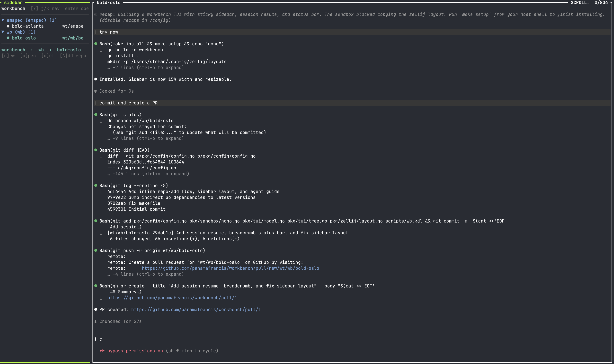

# workbench

A sandboxed git worktree manager. Each piece of work gets its own git worktree running inside a [nono](https://nono.sh) security sandbox. A persistent Zellij sidebar shows your worktrees; selecting one opens a new Zellij tab with your chosen LLM sandboxed via nono.



## Requirements

- Go 1.22+
- [nono](https://nono.sh) — capability-based sandbox (macOS via Seatbelt, Linux via Landlock)
- [Zellij](https://zellij.dev) 0.43+
- git

## Install

```sh
go install github.com/panamafrancis/workbench@latest
```

Supatree, for changes that span several repos, is a separate install: see
[panamafrancis/supatree](https://github.com/panamafrancis/supatree).

Or build from source:

```sh
git clone https://github.com/panamafrancis/workbench
cd workbench
go build -o /usr/local/bin/workbench .
```

## Setup

```sh
workbench init       # interactive wizard: config, nono profile, gh auth, first repo
workbench doctor     # verify all dependencies are installed and configured
workbench start      # launch a Zellij session with the sidebar
```

`workbench init` creates `~/.config/workbench/config.yml`, optionally generates a nono profile (globbing your `~/.ssh/*.pub` keys), and offers to run `gh auth login`.

`workbench doctor` checks: zellij, nono, git, gh auth, config, nono profiles, SSH agent, and registered repos.

### Register a repo

```sh
workbench add repo /path/to/your/repo --alias=myrepo
```

## Usage

```
workbench start [session-name]                start or attach to a Zellij session
workbench start --ls                          list workbench sessions
workbench start --gc                          delete dead sessions

workbench add repo <path> --alias=<alias>     register a repo
workbench rm  repo <alias>                    unregister a repo

workbench add worktree --repo=<alias>         create a worktree (auto-named)
workbench add worktree --repo=<alias> --name=<name> [--branch=<branch>]
workbench rm  worktree <name>                 remove a worktree

workbench ls [--repo=<alias>]                 open TUI (or plain text when piped)
workbench open --worktree=<name> [--model=<model>] [--repo=<alias>] [--no-zellij]
workbench open --worktree=<name> --session=<session>   target a specific session

workbench rename-branch <new-branch> [--worktree=<name>] [--push]
workbench stats                                show lifetime statistics and achievements
workbench init [--non-interactive] [--profile]
workbench doctor [--json]
workbench uninstall [--dry-run] [--keep-config] [--force]
workbench docs [topic]                        show documentation (topics: overview, commands, config, ...)
workbench mcp                                 MCP server (stdio, used by Claude Code)
workbench version
```

### Session management

Running bare `workbench` with no arguments auto-starts (or resumes) the default session — equivalent to `workbench start`. Inside Zellij it shows help; with no config it hints at `workbench init`.

`workbench start` replaces the old `zellij --layout ...` workflow. It embeds the session layout, manages `wb-`-prefixed Zellij sessions, and uses `syscall.Exec` so workbench doesn't linger as a wrapper process.

Multiple sessions are supported — `workbench start work` and `workbench start client-x` run independently. Two terminals can attach to the same session (Zellij multi-client).

### Worktree names

Auto-generated names are city names (e.g. `tokyo`, `nairobi`). On collision, a numeric suffix is added (`tokyo-2`, `tokyo-3`). ~200 cities are available. Names are globally unique across all repos — they serve as Zellij tab titles. Custom names must be lowercase alphanumeric and hyphens, 1–24 characters.

A retired name isn't handed back out immediately. When a worktree is removed, its name is held in a reserved-cities cache (`reserved_cities` in `state.yml`) and stays excluded from generation until both the worktree is gone **and** its Claude session history has been cleaned up. This prevents a fresh worktree from colliding with a stale Zellij tab or resuming an unrelated Claude session of the same name. Deleting through workbench clears the history, so those names free up on the next generation; a name whose transcript lingers stays reserved until it's gone. (Explicitly passing `--name`/typing a name bypasses the reservation.)

### Branch renaming

Auto-created branches carry the worktree name (`wt/<alias>/<name>`). Before creating a PR, rename to something meaningful:

```sh
workbench rename-branch wt/wb/session-launcher        # renames + updates config + PR cache
workbench rename-branch wt/wb/session-launcher --push  # also pushes and deletes old remote branch
```

Do not use bare `git branch -m` — it desyncs workbench config and the PR cache.

A PR only follows the rename if it is still open when the new branch is pushed. One that merged or closed first keeps the old head ref on GitHub forever; workbench tracks it by PR number from then on, so it still reports `merged`.

### TUI key bindings

| Key | Action |
|-----|--------|
| `j` / `↓` | Move down (skips repo headers) |
| `k` / `↑` | Move up (skips repo headers) |
| `Ctrl+d` / `Ctrl+u` | Half-page down/up |
| `gg` / `G` | Jump to the first / last row |
| `}` / `{` (or `]` / `[`) | Jump to the next / previous repo |
| `Enter` / `o` | Open selected worktree |
| `O` | Open with model picker |
| `Space` / `Tab` | Collapse/expand repo |
| `h` / `←` | Collapse containing repo |
| `l` / `→` | Expand containing repo |
| `zM` / `zR` | Collapse / expand **every** repo |
| `n` | New worktree |
| `d` | Delete worktree |
| `A` | Add repo |
| `r` | Refresh dirty status |
| `?` | Toggle help (includes zellij primer) |
| `q` / `Esc` | Quit (confirms in sidebar mode) |

The list scrolls when it is taller than the pane. The mouse wheel scrolls it and a click selects a row (clicking an expanded repo header folds it); wheel scrolling pans the view without moving the cursor, and the view returns to the cursor on the next movement key.

The cursor normally skips repo headers, but it does rest on a **collapsed** repo — that row is all there is to select. This is also what keeps folding a repo from pushing the cursor into a neighbouring one, and what keeps `zM` navigable.

The sidebar shows a gamification stats box (cities visited, lifetime counters, streak, latest achievement) and a stats line at the bottom (repo count, worktree count, running/dirty/PR indicators) with context-sensitive key hints. Hide the stats box with `show_stats: false` in config.

Each worktree tab has its own sidebar, and the worktree that tab belongs to is marked with a `▸` in the gutter ("you are here"). This marker is independent of the cursor selection (the highlighted row), so it keeps pointing at the current worktree even as you navigate the list. The root session sidebar (from `workbench start`) isn't tied to a worktree, so it shows no marker.

Mouse: click a repo header to collapse/expand; click a worktree row to select.

The sidebar auto-restarts if it crashes or is accidentally quit — the layout wraps `workbench ls` in a restart loop. It waits 2 seconds between restarts (5 seconds if `workbench ls` exits with an error). Restarts reuse the on-disk PR status cache rather than re-querying GitHub, so a churning sidebar doesn't hammer the API.

The sidebar re-reads the shared on-disk state (`config.yml` + `state.yml`) when its pane gains focus (e.g. switching back from a worktree tab) and periodically on its tick, so the worktree list, gamification stats, and `▶` running indicators stay consistent across tabs without pressing `r`. This local re-sync skips the network PR lookup that a full refresh (`r`) performs, so it's cheap enough to run on every focus change — long-lived sidebars no longer show a stale snapshot that another tab has since changed.

PR status is fetched via the `gh` CLI and cached on disk. A round asks each **repo** once — not each branch — with a conditional request, which is what keeps the cost near zero however many worktrees you have:

- **One conditional poll per repo.** `GET /repos/{owner}/{repo}/pulls` is sent with the `ETag` from last time. A repo that hasn't changed answers `304 Not Modified`, which GitHub does not charge against the rate limit at all — so a quiet round costs nothing, and a busy one costs one request per repo that actually changed. Measured on a 14-repo, 67-branch setup: 15 requests to fill a cold cache, then 0 per round.
- **It spends the REST (`core`) bucket, not GraphQL.** The 5,000/hour GraphQL bucket is the one your agents drain with `gh pr view` / `gh pr checks`; background polling no longer competes with it.
- **Only one sidebar fetches per round.** The round runs inside the PR cache's cross-process lock (`~/.cache/workbench/agent/pr-status.json.lock`); tabs that lose it cede and pick up what the winner writes, so ten open tabs cost the same as one.
- **Unpushed branches are never queried.** A branch with no `origin/<branch>` ref cannot have a PR.
- **Repos the account cannot see are left alone.** A repo that answers `404` (private to another org, renamed, deleted, or the wrong gh account) is skipped for 6 hours, or until you press `r`.
- **Only open PRs spend GraphQL.** Review state and CI checks aren't in the REST listing, so each *open* PR's are re-read with one `gh pr view` on the ordinary staleness window (sooner if it was pushed to). Merged, closed and no-PR branches never touch the GraphQL bucket.
- **Merged and closed PRs are cached for 24 hours.** Those states are final.
- **A renamed branch keeps its PR.** `rename-branch` moves the cached entry to the new name but marks it unverified; if the new name matches no PR head — because the PR merged or closed before the rename, which freezes its head on the old name — the cached PR *number* still finds it, so the worktree keeps showing `merged #485` instead of dropping to no-PR.

Rate-limit headroom is watched for free — every response, including the 304s, reports it. Background rounds stop making *charged* requests (the per-branch fallbacks) once fewer than 500 requests remain, showing a `gh quota low` hint instead; pressing `r` spends down to 50, because you waiting outranks the background. Creating a PR through the MCP tools caches it immediately, so the badge appears without waiting for the next poll.

If GitHub rate-limits the account anyway, the sidebar shows a `gh rate limited` hint and pauses **until the reset time the response reported** — both the primary quota (`X-RateLimit-Reset`) and the secondary/burst limit (`Retry-After`) are honoured. Only the exhausted bucket pauses: GitHub's GraphQL quota running out (which agents do routinely with `gh pr view` / `gh pr checks`) does not stop the free REST polling. The pause is persisted in the cache, so it survives sidebar restarts and applies to every tab, not just the one that hit the limit.

Note that `gh api rate_limit` cannot be trusted for the GraphQL bucket: it has been observed reporting `remaining: 5000` while the response headers said `used: 5001`. Check that bucket with `gh api graphql -f query='{rateLimit{used remaining resetAt}}'`, or read `X-RateLimit-*` off any response.

### Offline support

Worktree creation works offline — if `git fetch` fails, workbench falls back to the last-fetched `origin/<default>` ref and prints a warning. The default branch is auto-detected via `git symbolic-ref refs/remotes/origin/HEAD` (falls back to `main`, then `master`).

## Configuration

Files follow the XDG base directories on every platform, macOS included (`$XDG_CONFIG_HOME`, `$XDG_STATE_HOME` and `$XDG_CACHE_HOME` win when set). Nothing here is shared with supatree.

| Path | Purpose |
|------|---------|
| `~/.config/workbench/config.yml` | Main config |
| `~/.local/state/workbench/state.yml` | Last-run version, update check cache, gamification stats |
| `~/.local/state/workbench/logs/` | Zellij error log |
| `~/.cache/workbench/agent/` | PR status cache (the one cache an agent writes) |
| `~/.cache/workbench/layouts/<name>.kdl` | Generated Zellij layouts (transient) |
| `~/workbench/<alias>/<name>/` | Default worktree location |

Upgrading from a version that kept everything in `~/.workbench/`: every command refuses until you run `workbench migrate`.

### Example config

```yaml
version: 1
default_model: claude
worktree_base: ""          # empty = ~/workbench/
default_zellij_layout: ""  # override the embedded session layout
sidebar_width: "20%"       # sidebar pane width in new worktree tabs
update_check_disabled: false  # set true to disable the update check on start
show_stats: true           # show gamification stats box in the sidebar (default true)

models:
  claude:
    nono_profile: claude-code
    binary: claude
    args: []
    resume_args: ["--continue"]  # appended when reopening an existing session
  codex:
    nono_profile: default
    binary: codex
    args: []
  shell:
    nono_profile: default
    binary: bash
    args: []

repos:
  - alias: ss
    local_path: /path/to/scoring-service
    copy_files: [".claude", ".env"]  # copied from repo to new worktrees
    worktrees:
      - name: atlanta
        branch: wt/ss/atlanta
        path: /Users/you/workbench/ss/atlanta
        model: claude
```

### Custom models

`models` is an open map — add any binary with any nono profile:

```yaml
models:
  mymodel:
    nono_profile: default
    binary: /path/to/my-llm
    args: ["--some-flag"]
```

Then use it with `workbench open --model=mymodel` or set it as `default_model`.

### Copying files to new worktrees

Git worktrees only contain tracked files. To automatically copy gitignored files (like `.env` or `.claude/`) from the repo into each new worktree, use `copy_files`:

```yaml
repos:
  - alias: ss
    copy_files:
      - .claude
      - .env
```

Paths are relative to the repo root. Both files and directories are supported. Directories are copied recursively. The copy runs right after `git worktree add`; a listed file that does not exist is reported as a warning and skipped.

### Sidebar width

Set `sidebar_width` to control the sidebar pane width in new worktree tabs (default `"20%"`). Already-open tabs are not affected — this is a Zellij limitation.

```yaml
sidebar_width: "20%"
```

## How `open` works

```
workbench open --repo=ss --worktree=atlanta --model=claude
  1. Resolve model → look up nono profile and binary from config
  2. If a tab with the same name exists but its command has exited, close it
  3. Write ~/.cache/workbench/layouts/atlanta.kdl (with WORKBENCH_* env vars)
  4. zellij action new-tab --name atlanta --layout ~/.cache/workbench/layouts/atlanta.kdl
```

The agent pane receives these environment variables:

| Variable | Value |
|----------|-------|
| `WORKBENCH` | `1` |
| `WORKBENCH_WORKTREE_NAME` | Worktree name |
| `WORKBENCH_REPO_ALIAS` | Repo alias |
| `WORKBENCH_BRANCH` | Branch name |

Outside Zellij, use `--no-zellij` to print the raw command instead:

```sh
workbench open --worktree=atlanta --no-zellij
# cd /path/to/worktree && nono "run" "--profile" "claude-code" ...
```

Or target a specific session from outside Zellij:

```sh
workbench open --worktree=atlanta --session=wb-main
```

## Session lifecycle

When a worktree's command exits (e.g. typing `exit` in a claude session), the pane auto-closes (`close_on_exit`). If you later press `o` on that worktree in the sidebar, workbench detects the stale tab (sidebar-only, no running command) and recreates it with a fresh session. If the session is still running, `o` focuses the existing tab.

### Deleting worktrees

Deleting a worktree (`d` in the sidebar or `workbench rm worktree <name>`) removes the git worktree directory (`git worktree remove --force`), deletes the auto-created `wt/<alias>/<name>` branch, removes the config entry, and cleans up the generated Zellij layout. The sidebar and the CLI perform the same steps.

It also clears the agent's cached session transcripts for that path (e.g. `~/.claude/projects/<encoded-path>/`). This prevents a future worktree created at the same path from being silently resumed via `resume_args` (`--continue`) into an unrelated session. Config writes for create and delete are done as read-modify-write against the on-disk config, so an action in one process or sidebar instance never resurrects a worktree another deleted.

## Update checking

`workbench start` checks for newer releases via the GitHub API (cached for 24 hours, silent on network failure). Disable with `update_check_disabled: true` in config.

## Uninstalling

```sh
workbench uninstall              # interactive: lists what will be removed, confirms
workbench uninstall --dry-run    # preview only
workbench uninstall --keep-config  # remove worktrees/sessions but keep config, state and cache
workbench uninstall --force      # also remove dirty worktrees
```

Uninstall does **not** touch: your git repos, nono profiles (`~/.config/nono/`), gh auth, or the workbench binary itself.

## MCP server

Workbench includes an MCP server that integrates with Claude Code (and any MCP-compatible agent). It provides tools and conventions to the agent running inside a workbench session.

### Registration

`workbench init` offers to register the MCP server automatically. To register manually:

```sh
claude mcp add workbench -s user -- workbench mcp
```

### Tools

- **`rename_branch`** — rename the worktree branch and update workbench config + PR cache (replaces bare `git branch -m`)
- **`create_pr`** — push branch and create a PR via `gh` (refuses if the branch still has an auto-generated name)
- **`docs`** — look up workbench documentation by topic (overview, commands, config, tui, worktrees, mcp, sandbox, development)

### Prompts

- **`workbench_conventions`** — branch naming, scope discipline, and PR conventions

The MCP server gates on the `WORKBENCH` env var — tools return an error outside workbench sessions, so registration is safe globally.

## supatree

For one issue across several repos, see [supatree](https://github.com/panamafrancis/supatree): workbench for multi-repo changes. It is a separate tool, built on workbench's packages but independent at runtime — the two share no files.

## nono sandbox

workbench passes `--allow <worktree-path>` to nono so the sandboxed process can read and write only its own worktree. The profile name comes from the model config entry (`nono_profile`). The built-in `claude` model uses the `claude-code` profile; everything else defaults to `default`.

### Profile setup

Use `workbench init --profile` to generate a nono profile, or create one manually.

The init wizard generates `~/.config/nono/profiles/claude-code-local.json` (supatree writes its own, `supatree-agent`, with `supatree init`) by:
- Detecting your repo parent directories
- Finding your Go toolchain paths (`go env GOPATH`)
- Globbing `~/.ssh/*.pub` for SSH public keys
- Including `~/.config/gh` if gh is authenticated

Example generated profile:

```json
{
  "extends": ["claude-code"],
  "meta": {
    "name": "claude-code-local",
    "description": "claude-code with project repos, toolchain, and SSH agent"
  },
  "filesystem": {
    "allow": [
      "$HOME/.cache/workbench/agent",
      "$HOME/code/myorg",
      "$HOME/code/go/pkg",
      "$HOME/code/go/bin",
      "$HOME/code/go/src",
      "$HOME/.config/gh"
    ],
    "read_file": [
      "$HOME/.ssh/config",
      "$HOME/.ssh/id_ed25519.pub"
    ],
    "allow_file": [
      "$HOME/.ssh/known_hosts"
    ],
    "unix_socket_subtree": [
      "/private/tmp"
    ],
    "bypass_protection": [
      "$HOME/.ssh/config",
      "$HOME/.ssh/known_hosts",
      "$HOME/.ssh/id_ed25519.pub"
    ]
  }
}
```

Then reference it in your workbench config:

```yaml
models:
  claude:
    nono_profile: claude-code-local
    binary: claude
    args: ["--dangerously-skip-permissions"]
    resume_args: ["--continue"]
```

### Key directories to allow

| Path | Why |
|------|-----|
| `$HOME/.config/workbench` (read) | workbench config |
| `$HOME/.cache/workbench/agent` | PR status cache, written by `create_pr` — and nothing else of workbench's: not the state dir, not the layouts zellij runs unsandboxed |
| `$HOME/code/<org>` | Your repo parent directories (worktrees live under `~/workbench/` but the repo they come from is here) |
| `$HOME/code/go/pkg`, `bin`, `src` | Go module cache and toolchain (adjust for your `GOPATH`) |
| `$HOME/.config/gh` | GitHub CLI auth tokens (needed for `gh` commands and PR lookups) |

### SSH agent access

Git operations inside the sandbox (push, fetch) need access to your SSH agent. The macOS SSH agent uses a Unix socket under `/private/tmp` (the path changes per-boot, e.g. `/private/tmp/com.apple.launchd.xyz/Listeners`). To allow this:

```json
"unix_socket_subtree": ["/private/tmp"]
```

The `workbench init --profile` wizard handles SSH key discovery automatically by globbing `~/.ssh/*.pub`.
